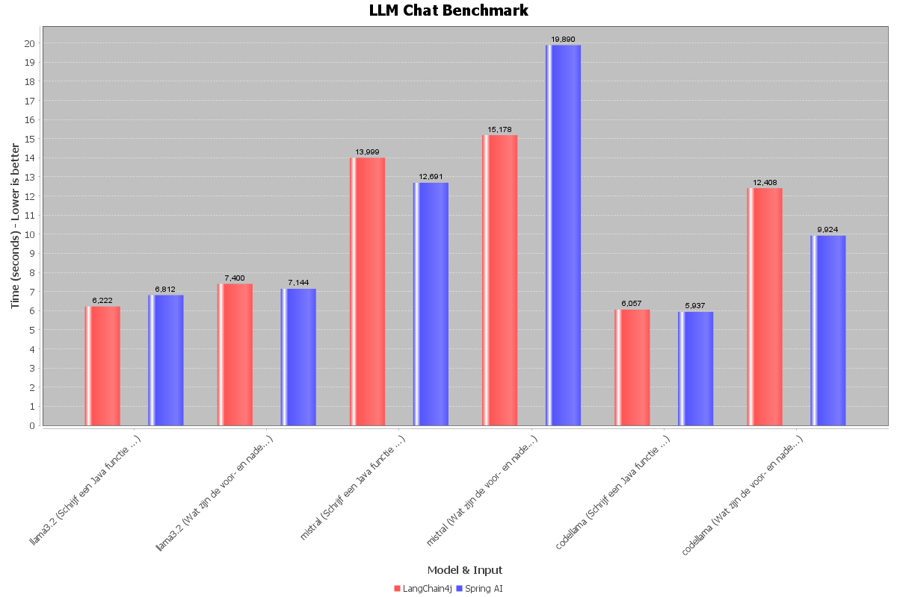
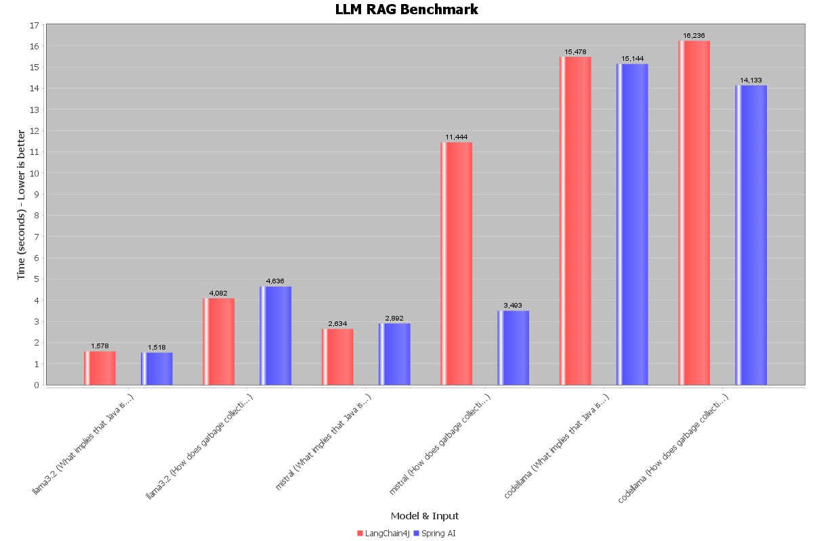
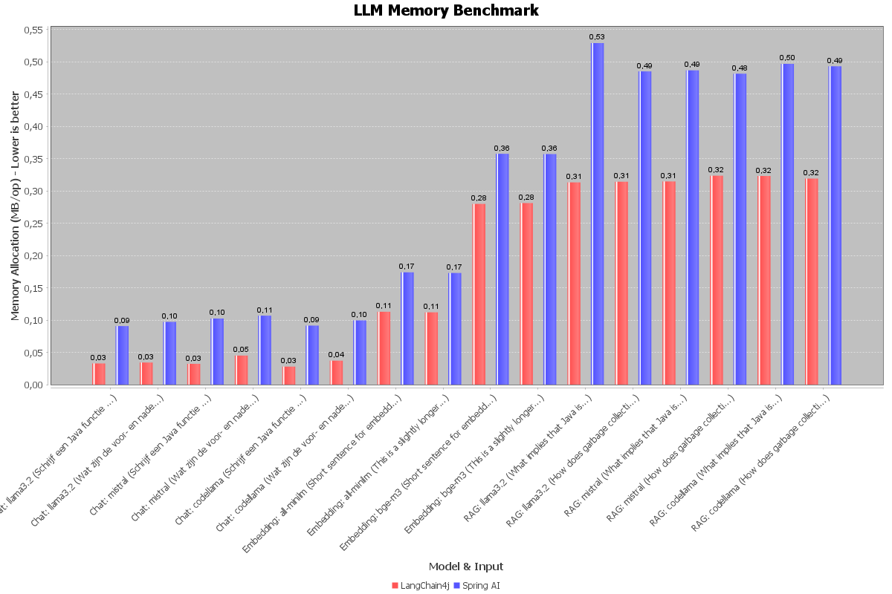

# LLMCompare4j: Java AI Framework Benchmarking Tool

A comprehensive benchmarking tool for comparing **LangChain4j** and **Spring AI** frameworks when integrating local Large Language Models (LLMs) via Ollama. This project provides objective performance data across chat, embedding, and RAG (Retrieval-Augmented Generation) pipelines.

---

## 📋 Table of Contents

1. [Overview](#overview)
2. [Project Motivation](#project-motivation)
3. [Features](#features)
4. [Architecture](#architecture)
5. [Technology Stack](#technology-stack)
6. [Installation Guide](#installation-guide)
7. [Configuration](#configuration)
8. [Usage](#usage)
9. [Benchmark Categories](#benchmark-categories)
10. [Results & Visualization](#results--visualization)
11. [Project Structure](#project-structure)
12. [Understanding the Code](#understanding-the-code)
13. [Running Benchmarks](#running-benchmarks)
14. [Troubleshooting](#troubleshooting)
15. [Contributing](#contributing)
16. [License](#license)

---

## 🎯 Overview

**LLMCompare4j** is a systematic benchmarking tool designed to objectively compare two popular Java frameworks for AI integration:

- **LangChain4j** (v0.35.0) - A Java port of the LangChain framework
- **Spring AI** (v1.0.0) - Spring's native AI framework

The tool measures performance across three critical AI scenarios that developers encounter in real-world applications:

1. **Chat Performance** - Direct LLM interaction for code generation and question answering
2. **Embedding Performance** - Text-to-vector conversion for semantic search
3. **RAG Pipelines** - Complete workflows combining document search and generation

All benchmarks run **locally** using [Ollama](https://ollama.ai/) with open-source models, ensuring:
- ✅ **Privacy** - No cloud dependencies or data transmission
- ✅ **Cost-effective** - No API charges
- ✅ **Reproducible** - Same results across machines
- ✅ **Fair comparison** - Both frameworks tested with identical models

---

## 💡 Project Motivation

### The Problem

Java developers integrating AI have multiple framework choices:
- **LangChain4j**: Established ecosystem, rich feature set
- **Spring AI**: Native Spring integration, modern approach

However, **systematic performance comparisons are rare**. Choosing between them is often based on hype rather than data.

### The Solution

This project bridges the gap by providing:

1. **Objective Performance Data** - Actual metrics, not marketing claims
2. **Practical Relevance** - Tests real-world scenarios (chat, embeddings, RAG)
3. **Industry Standards** - Uses JMH for reliable benchmarking
4. **Visual Insights** - JFreeChart graphs making findings accessible
5. **Reusable Framework** - Other developers can run the same tests

### Educational Value

This project demonstrates:
- Integration of two major Java AI frameworks
- Advanced benchmarking techniques using JMH
- Performance analysis and optimization strategies
- Data visualization for technical communication
- Systematic technology evaluation methodology

---

## ✨ Features

### Comprehensive Benchmarking

- **3 Benchmark Categories**: Chat, Embeddings, RAG
- **Multiple Models**: Test with Llama 3.2, Mistral, CodeLlama for chat; All-MiniLM, BGE-M3 for embeddings
- **Dual Framework Support**: Direct comparison between LangChain4j and Spring AI
- **Performance Metrics**: Response time, memory allocation, throughput

### Accurate Measurement

- **JMH Integration** - OpenJDK's Java Microbenchmark Harness
  - Eliminates JIT compiler noise
  - Multiple warm-up iterations for stability
  - Configurable fork and measurement parameters
  - GC profiler for memory analysis

### Rich Visualization

- **JFreeChart Integration** - Professional-quality charts
  - Separate visualizations for Chat, Embedding, RAG, and Memory metrics
  - Side-by-side framework comparison
  - Automatically generated PNG files
  - Clear legends and axis labels

### Extensible Architecture

- **Abstract Base Classes**: `AbstractChatBenchmark`, `AbstractEmbeddingBenchmark`, `AbstractRagBenchmark`
- **Easy to Add Frameworks**: Implement interface for new frameworks
- **Configurable Parameters**: Model names, prompts, and test parameters easily adjustable
- **Quality Reporting**: `QualityReporter` for output analysis

---

## 🏗️ Architecture

### Design Pattern

The project follows a **Template Method Pattern** combined with **JMH annotations**:

```
AbstractChatBenchmark (Template)
    ├── LangChain4jChatBenchmark (Concrete Implementation)
    └── SpringAiChatBenchmark (Concrete Implementation)

AbstractEmbeddingBenchmark (Template)
    ├── LangChain4jEmbeddingBenchmark (Concrete Implementation)
    └── SpringAiEmbeddingBenchmark (Concrete Implementation)

AbstractRagBenchmark (Template)
    ├── LangChain4jRagBenchmark (Concrete Implementation)
    └── SpringAiRagBenchmark (Concrete Implementation)
```

### Component Responsibilities

| Component | Role |
|-----------|------|
| `AbstractChatBenchmark` | Defines parameters: prompts, models; declares benchmark contract |
| `LangChain4jChatBenchmark` | Implements chat using LangChain4j's OllamaChatModel |
| `SpringAiChatBenchmark` | Implements chat using Spring AI's OllamaOperations |
| `BenchmarkVisualizer` | Collects JMH results and generates chart visualizations |
| `QualityReporter` | Analyzes output quality (token count, semantic relevance) |
| `Main` | Orchestrates JMH runner and coordinates visualization |

### Data Flow

```
Main.java
    ↓
JMH Runner (OptionsBuilder)
    ├→ Discovers @Benchmark annotations
    ├→ Runs Chat/Embedding/RAG benchmarks
    ├→ Applies GC profiler
    ↓
Collection<RunResult>
    ↓
BenchmarkVisualizer
    ├→ Parses results by framework/model/type
    ├→ Organizes data into datasets
    ↓
JFreeChart
    ↓
PNG Output Files
```

---

## 🛠️ Technology Stack

### Core Frameworks

| Technology | Version | Purpose |
|-----------|---------|---------|
| **Java** | 25 | Development language |
| **Maven** | 3.x | Dependency and build management |
| **LangChain4j** | 0.35.0 | AI framework #1 |
| **Spring AI** | 1.0.0 | AI framework #2 |
| **Ollama** | Latest | Local LLM runtime |

### Benchmarking & Profiling

| Tool | Version | Purpose |
|------|---------|---------|
| **JMH** | 1.37 | Microbenchmarking harness |
| **JMH-Generator** | 1.37 | Annotation processing for JMH |
| **GC Profiler** | Built-in | Memory and garbage collection metrics |

### Visualization

| Library | Version | Purpose |
|---------|---------|---------|
| **JFreeChart** | 1.5.4 | Professional charting library |

### Local LLM Support

| Model | Purpose | Framework |
|-------|---------|-----------|
| **Llama 3.2** | General-purpose chat | Both |
| **Mistral** | Fast inference, versatile | Both |
| **CodeLlama** | Code generation specialized | Both |
| **All-MiniLM-L6-v2** | Lightweight embeddings | LangChain4j |
| **BGE-M3** | Advanced embeddings | Both |

---

## 📦 Installation Guide

### Prerequisites

Before starting, ensure you have:

1. **Java Development Kit (JDK) 25+**
   ```bash
   java -version
   # Output should show Java 25 or higher
   ```

2. **Maven 3.8.1+**
   ```bash
   mvn --version
   # Output should show Maven 3.8.1 or higher
   ```

3. **Ollama**
   - Download from: https://ollama.ai/
   - Install for your operating system (macOS, Linux, Windows)
   - Verify installation:
     ```bash
     ollama --version
     ```

4. **Required Models** (download via Ollama)
   ```bash
   # Chat Models
   ollama pull llama3.2
   ollama pull mistral
   ollama pull codellama
   
   # Embedding Models (optional, depending on your setup)
   ollama pull nomic-embed-text
   ```

### Step-by-Step Setup

#### 1. Clone or Download the Project

```bash
# Clone if using Git
git clone https://github.com/DarioDML/LLMCompare4j.git
cd LLMCompare4j

# Or extract if downloaded as ZIP
unzip LLMCompare4j.zip
cd LLMCompare4j
```

#### 2. Install Dependencies

```bash
# Download all Maven dependencies
mvn clean install

# Expected output: BUILD SUCCESS
```

This command:
- Cleans previous builds
- Downloads LangChain4j, Spring AI, JMH, JFreeChart
- Generates JMH annotation processors
- Creates `target/` directory with compiled classes

#### 3. Start Ollama Server

```bash
# In a separate terminal, start Ollama
ollama serve

# Expected output: Ollama server running on http://localhost:11434
```

Leave this running during benchmarks. It:
- Hosts local LLM models
- Provides REST API on port 11434
- Manages model memory and inference

#### 4. Verify Setup

```bash
# Test Ollama connectivity
curl http://localhost:11434/api/tags

# Should return list of available models
```

#### 5. Compile the Project

```bash
mvn compile
```

Output structure:
```
target/
├── classes/
│   └── io/github/dariodml/llmcompare4j/
│       ├── Main.class
│       ├── AbstractChatBenchmark.class
│       ├── LangChain4jChatBenchmark.class
│       ├── SpringAiChatBenchmark.class
│       └── ... (other compiled classes)
├── generated-sources/
│   └── annotations/ (JMH generated code)
└── jars/
```

---

## ⚙️ Configuration

### Modifying Benchmark Parameters

All benchmark parameters are defined via JMH `@Param` annotations. To customize tests:

#### Chat Benchmark Configuration

Edit `AbstractChatBenchmark.java`:

```java
@Param({
    "Schrijf een Java functie die een lijst sorteert.",
    "Wat zijn de voor- en nadelen van virtuele threads in Java?"
})
public String prompt;

@Param({"llama3.2", "mistral", "codellama"})
public String modelName;
```

**To add a new prompt:**
```java
@Param({
    "Schrijf een Java functie die een lijst sorteert.",
    "Wat zijn de voor- en nadelen van virtuele threads in Java?",
    "Your new prompt here"  // Add here
})
public String prompt;
```

**To add a new model:**
```bash
# First pull the model in Ollama
ollama pull your-model-name

# Then add to @Param annotation
@Param({"llama3.2", "mistral", "codellama", "your-model-name"})
public String modelName;
```

#### Embedding Benchmark Configuration

Edit `AbstractEmbeddingBenchmark.java`:

```java
@Param({
    "Short sentence for embedding.",
    "This is a slightly longer paragraph..."
})
public String prompt;

@Param({"all-minilm", "bge-m3"})
public String modelName;
```

#### JMH Benchmark Settings

Edit `LangChain4jChatBenchmark.java` (apply same pattern to other benchmarks):

```java
@BenchmarkMode(Mode.AverageTime)      // Measurement: AverageTime, Throughput, etc.
@OutputTimeUnit(TimeUnit.SECONDS)     // Output: SECONDS, MILLISECONDS, NANOSECONDS
@Fork(value = 1, warmups = 0)         // Fork: number of JVM instances
@Warmup(iterations = 1, time = 10, timeUnit = TimeUnit.SECONDS)
@Measurement(iterations = 3, time = 10, timeUnit = TimeUnit.SECONDS)
```

**Configuration Explanation:**

| Setting | Purpose | Value | Notes |
|---------|---------|-------|-------|
| `BenchmarkMode` | What to measure | `AverageTime` | Average per operation |
| `OutputTimeUnit` | Time granularity | `SECONDS` | Use `MILLISECONDS` for faster operations |
| `Fork` | JVM instances | `1` | More forks = more stable, slower execution |
| `Warmup` | Warm-up iterations | `1` iteration, 10 seconds | Higher = more stable |
| `Measurement` | Main iterations | `3` iterations, 10 seconds | More iterations = better statistics |

**Recommended Configurations:**

- **Quick test (10-15 min)**: `Fork(1)`, `Warmup(1, 5s)`, `Measurement(2, 5s)`
- **Standard (60-90 min)**: `Fork(1)`, `Warmup(1, 10s)`, `Measurement(3, 10s)` ← Current
- **Thorough (2+ hours)**: `Fork(3)`, `Warmup(2, 15s)`, `Measurement(5, 15s)`

#### Ollama Connection Settings

Both chat benchmark implementations can be adjusted:

```java
// LangChain4jChatBenchmark.java
OllamaChatModel.builder()
    .baseUrl("http://localhost:11434")    // Ollama server URL
    .modelName(modelNameToUse)            // Model to use
    .temperature(0.7)                     // Creativity (0=deterministic, 1=random)
    .build()
```

### Main.java Configuration

Customize which benchmarks to run:

```java
Options opt = new OptionsBuilder()
    // Current: runs all Chat, Embedding, and RAG benchmarks
    .include(".*(Chat|Embedding|Rag)Benchmark.*")
    
    // Alternative: run only Chat benchmarks
    // .include(".*ChatBenchmark.*")
    
    // Alternative: run specific class
    // .include(".*LangChain4jChatBenchmark.*")
    
    .addProfiler(GCProfiler.class)        // Enable GC profiling
    .build();
```

---

## 🚀 Usage

### Basic Usage

#### 1. Ensure Ollama Server is Running

```bash
# In terminal 1, start Ollama
ollama serve
```

#### 2. Run Benchmarks

```bash
# In terminal 2, run from project root
mvn clean compile
mvn exec:java -Dexec.mainClass="io.github.dariodml.llmcompare4j.Main"

# Or use Java directly
java -cp target/classes:target/dependency/* io.github.dariodml.llmcompare4j.Main
```

#### 3. View Results

The benchmark generates output:

```
# Console Output (showing execution progress)
Benchmark Result: LangChain4jChatBenchmark.benchmarkChat
  Llama 3.2: 2.34 seconds average
  Mistral: 1.89 seconds average

Benchmark Result: LangChain4jEmbeddingBenchmark.benchmarkEmbedding
  All-MiniLM: 45 ms average
  BGE-M3: 120 ms average

# Generated Chart Files
benchmark_resultaten_chat.png       # Chat performance comparison
benchmark_resultaten_embedding.png  # Embedding performance comparison
benchmark_resultaten_rag.png        # RAG pipeline comparison
benchmark_resultaten_memory.png     # Memory allocation comparison
```

### Advanced Usage Examples

#### Example 1: Test Only One Framework

**Scenario**: You only want to benchmark LangChain4j

**Solution**: Modify `Main.java`:

```java
Options opt = new OptionsBuilder()
    .include(".*LangChain4j.*Benchmark.*")  // Changed filter
    .addProfiler(GCProfiler.class)
    .build();
```

#### Example 2: Focused Model Testing

**Scenario**: Compare only Llama 3.2 across frameworks

**Solution**: Modify `AbstractChatBenchmark.java`:

```java
@Param({"Schrij een Java functie die een lijst sorteert."})  // Single prompt
public String prompt;

@Param({"llama3.2"})  // Single model
public String modelName;
```

#### Example 3: Extended Test Suite

**Scenario**: Run comprehensive benchmarks with multiple iterations

**Solution**: Modify benchmark annotations:

```java
@Fork(value = 3, warmups = 0)
@Warmup(iterations = 2, time = 15, timeUnit = TimeUnit.SECONDS)
@Measurement(iterations = 5, time = 15, timeUnit = TimeUnit.SECONDS)
public class LangChain4jChatBenchmark extends AbstractChatBenchmark { ... }
```

---

## 📊 Benchmark Categories

### 1. Chat Benchmarks

**Purpose**: Measure LLM response generation performance

**Test Parameters**:
- **Models**: Llama 3.2, Mistral, CodeLlama
- **Prompts** (Dutch):
  1. `"Schrijf een Java functie die een lijst sorteert."` (Sort function)
  2. `"Wat zijn de voor- en nadelen van virtuele threads in Java?"` (Virtual threads explanation)

**Measured Metrics**:
- **Average response time** (seconds)
- **Memory allocation per operation** (MB/op)
- **GC activity**

**Real-world Relevance**:
- Code generation features
- Question answering systems
- Customer support chatbots

**Sample Benchmark Configuration**:
```
LangChain4jChatBenchmark.benchmarkChat
├─ llama3.2 + Prompt 1
├─ llama3.2 + Prompt 2
├─ mistral + Prompt 1
├─ mistral + Prompt 2
├─ codellama + Prompt 1
└─ codellama + Prompt 2
```

### 2. Embedding Benchmarks

**Purpose**: Measure text-to-vector conversion performance

**Test Parameters**:
- **Models**: All-MiniLM-L6-v2, BGE-M3
- **Text Samples**:
  1. Short: `"Short sentence for embedding."`
  2. Long: `"This is a slightly longer paragraph..."` (full semantic context)

**Measured Metrics**:
- **Average embedding time** (milliseconds)
- **Memory allocation** (KB/op)
- **Vector consistency**

**Real-world Relevance**:
- Semantic search systems
- Similarity matching
- Recommendation engines
- Document classification

**Sample Benchmark Configuration**:
```
LangChain4jEmbeddingBenchmark.benchmarkEmbedding
├─ all-minilm + Short text
├─ all-minilm + Long text
├─ bge-m3 + Short text
└─ bge-m3 + Long text
```

### 3. RAG Benchmarks

**Purpose**: Measure complete Retrieval-Augmented Generation pipeline performance

**Components**:
1. **Retrieval**: Document search using embeddings (in-memory vector store)
2. **Context**: Prepare relevant document chunks (top-2 similarity matches)
3. **Generation**: Generate answer using retrieved context

**Test Parameters**:
- **Chat Models**: Llama 3.2, Mistral, CodeLlama
- **Embedding Models**: All-MiniLM, BGE-M3
- **Test Prompts** (English):
  1. `"What implies that Java is platform independent?"`
  2. `"How does garbage collection work?"`
- **Document Set**: 5 predefined Java knowledge base documents
- **Retrieval Config**: Top-2 results, similarity threshold 0.5

**Measured Metrics**:
- **Total pipeline time** (seconds) - from query to final answer
- **Framework overhead** - LangChain4j vs Spring AI comparison
- **Memory allocation per operation**
- **GC activity**

**Implementation Details**:
- **LangChain4j**: Uses AiServices with ContentRetriever and InMemoryEmbeddingStore
- **Spring AI**: Uses ChatClient with QuestionAnswerAdvisor and SimpleVectorStore
- **No document splitting**: Both frameworks ingest raw 5 documents without splitting for fair comparison

**Real-world Relevance**:
- Knowledge bases and FAQ systems
- Technical documentation assistants
- Enterprise search
- Compliance and legal document analysis

---

## 📈 Results & Visualization

### Output Files

After running benchmarks, the following charts are generated in PNG format with 1200x800 pixel resolution:

#### 1. Chat Benchmark Chart (`benchmark_resultaten_chat.png`)

**Shows**:
- Average response time for each framework/model/prompt combination
- LangChain4j vs Spring AI side-by-side
- Different colors for each framework

**Interpretation**:
- Lower bars = faster responses = better performance
- Consistent across models = stable implementation
- Framework differences = overhead differences

**Example Reading**:
```
Llama 3.2 (Sort Java function)
├─ LangChain4j: 2.1 seconds
└─ Spring AI: 2.3 seconds
→ Interpretation: LangChain4j ~10% faster for this task
```

#### 2. Embedding Benchmark Chart (`benchmark_resultaten_embedding.png`)

**Shows**:
- Embedding operation time (milliseconds)
- Model quality tradeoff (smaller/faster vs larger/accurate)
- Framework comparison

**Interpretation**:
- All-MiniLM: Fast but less accurate
- BGE-M3: Slower but superior semantic understanding
- Choose based on latency vs quality requirements

**Example Reading**:
```
All-MiniLM (Short text)
├─ LangChain4j: 15 ms
└─ Spring AI: 18 ms
→ Interpretation: Both are similar; all-minilm is practical for real-time search
```

#### 3. RAG Pipeline Chart (`benchmark_resultaten_rag.png`)

**Shows**:
- End-to-end pipeline time
- Component breakdown (retrieval + generation)
- Framework scalability with document set size

#### 4. Memory Usage Chart (`benchmark_resultaten_memory.png`)

**Shows**:
- Memory allocated per operation (MB/op)
- GC pressure from each framework
- Memory efficiency ranking

**Interpretation**:
- Lower = more memory-efficient
- Spikes = potential memory leaks or inefficient patterns
- Important for long-running applications

### Interpreting Results

#### Performance Metrics Explained

| Metric | Unit | Good Value | Bad Value | Notes |
|--------|------|-----------|-----------|-------|
| **Chat Response Time** | seconds | < 5s | > 15s | Depends on model size |
| **Embedding Speed** | ms | < 100ms | > 500ms | All-MiniLM is faster than BGE-M3 |
| **RAG Pipeline Time** | seconds | < 10s | > 30s | Includes retrieval + generation |
| **Memory Allocation** | MB/op | < 50MB | > 200MB | Can spike with large models |
| **GC Collections** | count | < 5 | > 20 | Indicates memory pressure |

#### Framework Comparison Checklist

When comparing results:

- [ ] **Consistent across models?** If one framework is faster, does it remain faster across all models?
- [ ] **Memory stable?** Are memory patterns predictable?
- [ ] **Error rate?** Did all operations complete successfully?
- [ ] **Real-world tradeoff?** Speed vs accuracy vs memory?

### Exporting Results

To save benchmarks for documentation:

```bash
# Results are already saved as PNG files
# Copy to documentation folder
cp benchmark_resultaten_*.png ../docs/

# For detailed data, capture console output
mvn exec:java -Dexec.mainClass="io.github.dariodml.llmcompare4j.Main" > benchmark_results.txt
```

---

## 📁 Project Structure

### Complete File Hierarchy

```
LLMCompare4j/
├── pom.xml                                 # Maven configuration
├── README.md                               # This file
├── src/
│   ├── main/
│   │   ├── java/io/github/dariodml/llmcompare4j/
│   │   │   ├── Main.java                  # Entry point, JMH orchestrator
│   │   │   │
│   │   │   ├── AbstractChatBenchmark.java
│   │   │   ├── LangChain4jChatBenchmark.java
│   │   │   ├── SpringAiChatBenchmark.java
│   │   │   │
│   │   │   ├── AbstractEmbeddingBenchmark.java
│   │   │   ├── LangChain4jEmbeddingBenchmark.java
│   │   │   ├── SpringAiEmbeddingBenchmark.java
│   │   │   │
│   │   │   ├── AbstractRagBenchmark.java
│   │   │   ├── LangChain4jRagBenchmark.java
│   │   │   ├── SpringAiRagBenchmark.java
│   │   │   │
│   │   │   ├── BenchmarkVisualizer.java   # Chart generation
│   │   │   └── QualityReporter.java       # Output analysis
│   │   └── resources/                     # Configuration files
│   └── test/
│       └── java/...                       # Unit tests (optional)
├── target/
│   ├── classes/                           # Compiled Java classes
│   ├── generated-sources/
│   │   └── annotations/                   # JMH-generated code
│   └── ...
└── .gitignore                             # Git configuration

# Output Files (generated after running benchmarks)
└── benchmark_resultaten_*.png
```

### Key File Descriptions

#### Core Entry Point

**`Main.java`** (28 lines)
- Configures JMH with options builder
- Includes Chat, Embedding, and RAG benchmarks
- Activates GC profiler for memory metrics
- Captures results and passes to visualizer
- Minimal boilerplate, maximum functionality

#### Abstract Base Classes (Template Method Pattern)

**`AbstractChatBenchmark.java`** (15 lines)
- Defines benchmark scope (Thread)
- Parameterizes prompts and models via `@Param`
- Declares abstract `chat()` method
- Subclasses implement framework-specific logic

**`AbstractEmbeddingBenchmark.java`** (15 lines)
- Similar pattern for embedding operations
- Parameters: text samples and embedding models
- Declares abstract `embed()` method

**`AbstractRagBenchmark.java`** (variable)
- Complete pipeline: retrieval + generation
- Parameters: document set, query, model combination

#### Concrete Implementations

**`LangChain4jChatBenchmark.java`** (40 lines)
- Uses `OllamaChatModel` from LangChain4j
- Manages model lifecycle with `@Setup(Level.Trial)`
- Implements lazy initialization for non-JMH calls
- Benchmark method annotated with `@Benchmark`

**`SpringAiChatBenchmark.java`** (40 lines)
- Uses Spring AI's `OllamaOperations`
- Similar pattern to LangChain4j version
- Demonstrates framework-specific integration

**`LangChain4jEmbeddingBenchmark.java`** & `SpringAiEmbeddingBenchmark.java`
- Framework-specific embedding implementations
- EmbeddingModel interfaces differ between frameworks

**`LangChain4jRagBenchmark.java`** & `SpringAiRagBenchmark.java`
- Complex implementations combining retrieval + generation
- Often the most representative of production usage

#### Utilities

**`BenchmarkVisualizer.java`** (102 lines)
- Processes `Collection<RunResult>` from JMH
- Extracts framework, model, prompt, type from results
- Groups data into 4 datasets: Chat, Embedding, RAG, Memory
- Creates JFreeChart instances with proper labels
- Exports PNG files to project root
- Handles both primary (time) and secondary (memory) metrics

**`QualityReporter.java`** (variable)
- Analyzes semantic quality of generated outputs
- Measures token count, semantic relevance
- Provides quality scores alongside performance metrics

---

## 🔍 Understanding the Code

### How JMH Works in This Project

#### 1. Annotation Processing Phase (Compile Time)

When you run `mvn compile`:

```
@Benchmark → JMH Generator → Bytecode in target/generated-sources/
```

Key files generated (visible in `target/generated-sources/annotations/`):
- `LangChain4jChatBenchmark_benchmarkChat_jmhTest.java`
- `LangChain4jChatBenchmark_jmhType_B1.java`, `_B2.java`, `_B3.java`

These generated classes handle:
- Parameter combinations (Cartesian product)
- JIT warm-up control
- GC measurement
- Statistical collection

#### 2. Benchmark Execution Phase (Runtime)

When you run `mvn exec:java`:

```
OptionsBuilder
    ↓
JMH Runner discovers benchmarks via classpath scanning
    ↓
For each benchmark × model × prompt combination:
    1. Warm-up iterations (JIT compilation)
    2. Measurement iterations (actual benchmark)
    3. Collect results (time, memory, GC stats)
    ↓
Results aggregated into Collection<RunResult>
    ↓
BenchmarkVisualizer processes results
```

#### 3. Key Annotations Explained

```java
@State(Scope.Thread)
// One instance per thread, persisted across iterations
// Used for LLM model instances (expensive to create)

@Benchmark
// Marks method as a benchmark
// JMH measures this method's execution

@Param({"value1", "value2"})
// Creates parameter combinations
// Cartesian product of all @Param annotations

@Setup(Level.Trial)
// Initialization before each trial
// Used to initialize models (happens once per trial)

@BenchmarkMode(Mode.AverageTime)
// Measures average time per operation
// Alternative: Throughput, SampleTime, SingleShotTime

@OutputTimeUnit(TimeUnit.SECONDS)
// Output granularity - easier to read for slow operations

@Fork(value = 1)
// Spawn 1 JVM instance for benchmark
// Higher = more stable, slower execution

@Warmup(iterations = 1, time = 10)
// Warm-up iterations (JIT compilation)

@Measurement(iterations = 3, time = 10)
// Actual benchmark iterations for statistics
```

### Framework Integration Patterns

#### LangChain4j Pattern

```java
// 1. Create client
OllamaChatModel model = OllamaChatModel.builder()
    .baseUrl("http://localhost:11434")
    .modelName("llama3.2")
    .build();

// 2. Generate response
String response = model.generate(prompt);
```

**Characteristics**:
- Direct, simple API
- Fluent builder pattern
- No framework dependency
- Lightweight

#### Spring AI Pattern

```java
// 1. Inject template
@Autowired
private OllamaOperations ollamaOperations;

// 2. Create message
Message message = new UserMessage(prompt);

// 3. Generate response
String response = ollamaOperations.call(message).getResult().getOutput().getContent();
```

**Characteristics**:
- Spring framework integration
- Dependency injection
- More enterprise-oriented
- Greater framework alignment

### Result Processing Flow

```java
// In BenchmarkVisualizer.java

for (RunResult result : results) {
    // 1. Extract primary metrics
    double score = result.getPrimaryResult().getScore();
    // score = average time in output unit (seconds)
    
    // 2. Determine benchmark type
    String benchmarkClass = result.getParams().getBenchmark();
    // e.g., "org.example.LangChain4jChatBenchmark"
    
    // 3. Extract parameters
    String modelName = result.getParams().getParam("modelName");
    String prompt = result.getParams().getParam("prompt");
    // Parameters come from @Param annotations
    
    // 4. Determine framework
    String framework = benchmarkClass.contains("LangChain") ? "LangChain4j" : "Spring AI";
    
    // 5. Extract secondary metrics (memory)
    Result memoryResult = result.getSecondaryResults().get("gc.alloc.rate.norm");
    double memoryInMB = memoryResult.getScore() / 1024.0 / 1024.0;
    
    // 6. Add to appropriate dataset
    datasets.get(benchmarkType).addValue(score, framework, category);
}
```

### Extending the Project

#### Adding a New LLM Model

**Step 1**: Pull the model in Ollama
```bash
ollama pull your-new-model
```

**Step 2**: Add to benchmark parameters
```java
@Param({"llama3.2", "mistral", "your-new-model"})
public String modelName;
```

**Step 3**: Recompile and run
```bash
mvn clean compile
mvn exec:java -Dexec.mainClass="io.github.dariodml.llmcompare4j.Main"
```

#### Adding a New Framework

**Step 1**: Add dependency to `pom.xml`
```xml
<dependency>
    <groupId>your.framework</groupId>
    <artifactId>your-ai-framework</artifactId>
    <version>1.0.0</version>
</dependency>
```

**Step 2**: Create benchmark classes
```java
public class YourFrameworkChatBenchmark extends AbstractChatBenchmark {
    // Implement chat() using your framework
    @Override
    public String chat(String prompt, String modelName) {
        // Your framework integration here
    }
}
```

**Step 3**: Update Main.java filter
```java
.include(".*(Chat|Embedding|Rag)Benchmark.*")
// Already matches "YourFrameworkChatBenchmark"
```

---

## 🏃 Running Benchmarks

### Quick Start (5 minutes)

```bash
# Terminal 1: Start Ollama
ollama serve

# Terminal 2: Run benchmarks (quick version)
cd LLMCompare4j
mvn clean compile
mvn exec:java -Dexec.mainClass="io.github.dariodml.llmcompare4j.Main"
```

### Standard Run (45 minutes)

Current configuration in code - default, balanced approach:
- 1 fork per benchmark
- 1 warm-up iteration (10 seconds)
- 3 measurement iterations (10 seconds each)
- Includes GC profiler

```bash
mvn clean compile
mvn exec:java -Dexec.mainClass="io.github.dariodml.llmcompare4j.Main"
```

### Comprehensive Run (2+ hours)

For thorough analysis, modify benchmark settings:

```java
// In concrete benchmark classes
@Fork(value = 3, warmups = 0)
@Warmup(iterations = 2, time = 15, timeUnit = TimeUnit.SECONDS)
@Measurement(iterations = 5, time = 15, timeUnit = TimeUnit.SECONDS)
```

Then run:
```bash
mvn clean compile
mvn exec:java -Dexec.mainClass="io.github.dariodml.llmcompare4j.Main"
```

### Selecting Specific Tests

#### Run Only Chat Benchmarks

```java
// In Main.java
Options opt = new OptionsBuilder()
    .include(".*ChatBenchmark.*")  // Changed filter
    .addProfiler(GCProfiler.class)
    .build();
```

#### Run Only LangChain4j

```java
Options opt = new OptionsBuilder()
    .include(".*LangChain4j.*Benchmark.*")
    .addProfiler(GCProfiler.class)
    .build();
```

#### Run Only One Model

```java
// In AbstractChatBenchmark.java
@Param({"llama3.2"})  // Single model only
public String modelName;
```

### Monitoring During Execution

**Terminal Output Example**:
```
# JMH provides iteration-by-iteration feedback

# Iteration 1 (Warm-up)
i   1: 2.234 s/op

# Iteration 2 (Measurement)
i   1: 2.189 s/op

# Iteration 3 (Measurement)
i   2: 2.156 s/op

# Statistics
Result "org.example.LangChain4jChatBenchmark.benchmarkChat":
  2.173 ±(99.9%) 0.074 s/op
  
# Chart generation
Generating benchmark_resultaten_chat.png...
Generating benchmark_resultaten_embedding.png...
Generating benchmark_resultaten_rag.png...
Generating benchmark_resultaten_memory.png...
Done!
```

### Troubleshooting Execution

#### Issue: "Connection refused" to Ollama

```
Error: Cannot connect to http://localhost:11434
```

**Solution**:
```bash
# Ensure Ollama is running
ollama serve

# Or check if running on different port
curl http://localhost:11434/api/tags
```

#### Issue: "Model not found"

```
Error: llama3.2 not found
```

**Solution**:
```bash
# List available models
ollama list

# Pull missing model
ollama pull llama3.2
```

#### Issue: Out of memory during benchmarks

```
java.lang.OutOfMemoryError: Java heap space
```

**Solution**:
```bash
# Increase JVM heap
mvn -Xmx4g exec:java -Dexec.mainClass="io.github.dariodml.llmcompare4j.Main"

# Or modify fewer parameters to reduce combinations
@Param({"llama3.2"})  # instead of all 3 models
```

---

## 🐛 Troubleshooting

### Common Issues & Solutions

#### 1. Build Issues

**Problem**: `maven-compiler-plugin` errors

```
[ERROR] Failed to execute goal org.apache.maven.plugins:maven-compiler-plugin
```

**Causes & Solutions**:
- Wrong Java version: Ensure Java 25+
  ```bash
  java -version  # Should show 25.x.x
  ```
- Missing dependencies: Clear cache
  ```bash
  mvn clean install -U  # Update dependencies
  ```

**Problem**: JMH annotation processor not found

```
[ERROR] Annotation processing error: processor not found
```

**Solution**:
- Ensure `jmh-generator-annprocess` in pom.xml
- Run `mvn clean compile`
- Check `target/generated-sources/annotations/` exists

#### 2. Runtime Issues

**Problem**: Benchmarks crash with NullPointerException or connection errors

```
Exception: Unable to connect to http://localhost:11434
java.net.ConnectException: Connection refused
```

**Cause**: Ollama server not running, unreachable, or model not available

**Solution**:
```bash
# Check Ollama status
ps aux | grep ollama

# Restart Ollama
ollama serve

# Test connectivity
curl http://localhost:11434/api/tags
```

**Problem**: "Model not found" error

```
java.lang.IllegalArgumentException: Model 'your-model' not found
```

**Solution**:
```bash
# List available models
ollama list

# Pull missing model
ollama pull your-model

# Verify
ollama show your-model
```

#### 3. Memory & Performance Issues

**Problem**: Slow benchmarks / system unresponsive

**Causes**:
- Ollama models loaded in GPU + JVM in system RAM
- Reduce benchmark iterations temporarily
- Run one framework at a time

**Solution**:
```java
// Reduce parameter combinations
@Param({"llama3.2"})  // Instead of all 3
public String modelName;

@Param({"Schrij een Java functie..."})  // Instead of 2
public String prompt;

// Or modify Main.java
.include(".*LangChain4j.*ChatBenchmark.*")  // Chat only, not all types
```

**Problem**: Out of memory (OOM) errors

```
Exception in thread "main" java.lang.OutOfMemoryError: Java heap space
```

**Solution**:
```bash
# Increase JVM heap
export MAVEN_OPTS="-Xmx8g"
mvn exec:java -Dexec.mainClass="io.github.dariodml.llmcompare4j.Main"

# Or system-level
mvn -Xmx8g -XX:+UseG1GC exec:java -Dexec.mainClass="io.github.dariodml.llmcompare4j.Main"
```

#### 4. Output Issues

**Problem**: No chart files generated

```
Expected: benchmark_resultaten_chat.png, benchmark_resultaten_embedding.png, etc.
Actual: No files created
```

**Causes**:
- JFreeChart not in dependencies
- File write permission issues
- Results dataset empty

**Solution**:
```bash
# Check file permissions
ls -la *.png

# Check console output for errors
mvn exec:java -Dexec.mainClass="io.github.dariodml.llmcompare4j.Main" 2>&1 | tail -20

# Verify JFreeChart version in pom.xml
mvn dependency:tree | grep jfreechart
```

**Problem**: Charts are blank or malformed

**Cause**: Results not collected properly

**Solution**:
- Ensure benchmarks ran successfully (check console)
- Verify results parsing in BenchmarkVisualizer
- Add debug logging:
  ```java
  System.out.println("Dataset entries: " + dataset.getColumnCount());
  System.out.println("Score: " + score);
  ```

#### 5. Ollama Issues

**Problem**: Ollama won't start

```
Error: failed to connect
```

**Solutions**:
```bash
# Check Ollama installation
which ollama

# Restart Ollama service
killall ollama
ollama serve

# Check logs
# Linux/Mac: ~/.ollama/logs
# Windows: %USERPROFILE%\.ollama
```

**Problem**: Models very slow or crashing

**Cause**: Insufficient system resources

**Solution**:
- Close other applications
- Use smaller models (all-minilm instead of bge-m3)
- Reduce test parameters
- Increase Ollama memory limit (see Ollama docs)

---

## 🤝 Contributing

### How to Contribute

1. **Fork the repository**
   ```bash
   git clone https://github.com/DarioDML/LLMCompare4j.git
   cd LLMCompare4j
   ```

2. **Create a feature branch**
   ```bash
   git checkout -b feature/your-feature-name
   ```

3. **Make your changes** (see areas below)

4. **Commit and push**
   ```bash
   git add .
   git commit -m "Add: Description of changes"
   git push origin feature/your-feature-name
   ```

5. **Create a Pull Request**

### Contribution Areas

#### Add New Frameworks

Implement benchmarks for:
- Langchain (Python, for comparison)
- LlamaIndex
- Semantic Kernel
- Other Java AI frameworks

#### Add More Models

Test with:
- GGUF format models
- Quantized versions
- Specialized models (math, code, chat-specific)

#### Enhance Reporting

Improve `QualityReporter`:
- BLEU/ROUGE score implementation
- Token count analysis
- Latency percentiles
- Cost analysis

#### Documentation

- Benchmark interpretation guides
- Model selection flowchart
- Performance tuning guide
- Framework comparison matrix

#### Testing

- Unit tests for benchmark classes
- Integration tests for Ollama connectivity
- CI/CD pipeline setup

---

## 📄 License

This project is provided as-is for educational purposes.

### Terms

- **Educational Use**: Free for learning and research
- **Commercial Use**: Contact for licensing
- **Attribution**: Credit to DarioDML and Erasmus Hogeschool Brussel

---

## 📚 Additional Resources

### Documentation Links

- **LangChain4j**: https://github.com/langchain4j/langchain4j
- **Spring AI**: https://github.com/spring-projects/spring-ai
- **Ollama**: https://ollama.ai/
- **JMH Guide**: https://github.com/openjdk/jmh/wiki/Perftest-Kit
- **JFreeChart**: https://www.jfree.org/jfreechart/

### Learning Resources

- JMH Benchmarking: https://www.baeldung.com/java-microbenchmark-harness
- LangChain4j Tutorial: https://docs.langchain4j.dev/
- Spring AI Getting Started: https://docs.spring.io/spring-ai/docs/current/reference/html/
- Ollama Model Library: https://ollama.ai/library

### Related Projects

- LangChain (JavaScript, Python)
- LlamaIndex (Python)
- Semantic Kernel (C#, Python, Java)

---

## 📞 Support & Questions

### Getting Help

1. **Check existing issues**: https://github.com/DarioDML/LLMCompare4j/issues
2. **Review troubleshooting section** (above)
3. **Check logs**: Look for error messages in console output
4. **Search documentation**: Use Ctrl+F to find topics

### Reporting Issues

When reporting bugs, include:
- Java version (`java -version`)
- Operating system
- Error message / stack trace
- Steps to reproduce
- Configuration (number of models, iterations, etc.)

---

## 💻 Benchmark Results

### System Specifications

| Component | Specification |
|-----------|---------------|
| **CPU** | AMD Ryzen 9 7940HS w/ Radeon 780M Graphics |
| **CPU Speed** | 4.00 GHz |
| **RAM** | 16.0 GB |
| **GPU** | NVIDIA RTX 4060 Laptop |

### Benchmark Results

#### Chat Performance


#### Embedding Performance


#### RAG Pipeline Performance


#### Memory Usage


---

## 🎓 Educational Context

**Institution**: Erasmus Hogeschool Brussel  
**Course**: Java Advanced (2025-2026)  
**Project Type**: Framework Comparison & Benchmarking  
**Complexity**: Intermediate-Advanced

### Learning Objectives Covered

- ✅ Integration of multiple Java frameworks
- ✅ Performance benchmarking techniques
- ✅ JMH annotation processing and bytecode generation
- ✅ Systematic technology evaluation
- ✅ Data visualization and analysis
- ✅ Maven build automation
- ✅ Local LLM integration (Ollama)
- ✅ Design patterns (Template Method, Builder)

---

**Last Updated**: December 1, 2025  
**Version**: 1.0.0  
**Status**: Active Development

For the latest information and updates, visit: https://github.com/DarioDML/LLMCompare4j
